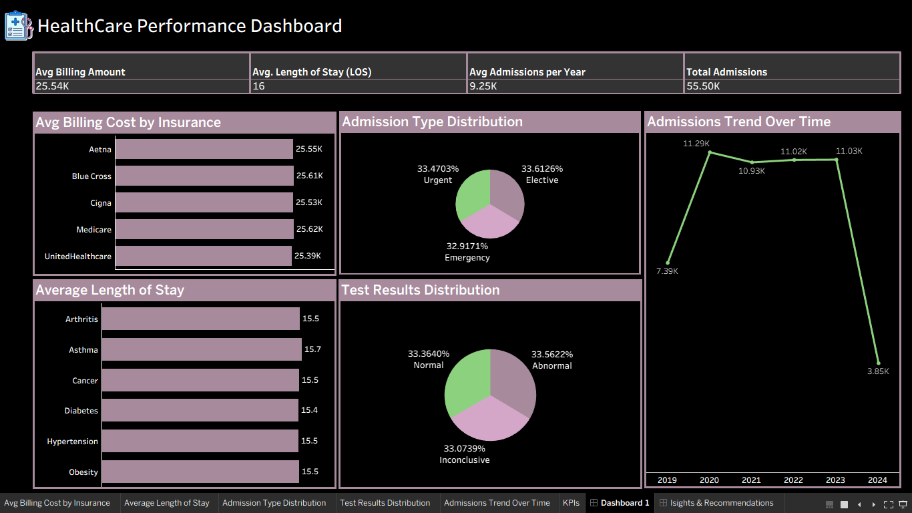

# 🏥 HealthCare Performance Dashboard (Tableau)

An interactive and comprehensive healthcare analytics dashboard built to monitor hospital operational efficiency, patient demographics, insurance billing distributions, and length of stay trends.

---

## 📊 Dashboard Preview

  

---

## 💡 Insights & Recommendations

  

---

## 📁 Repository Files
- **`Dashboard.png`**: Visual overview of the primary performance dashboard.
- **`Isights & Recommendations.jpg`**: Detailed breakdown of analytical insights and operational recommendations.
- **`healthcare_tableau.twbx`**: The Tableau packaged workbook file.
- **`healthcare_dataset.csv`**: The raw dataset used for analysis.

---

## 🛠️ Tools & Technologies Used
- **Tableau**: For data visualization, KPI calculations, and interactive dashboard design.
- **Data Modeling & Aggregation**: Handling metrics like Average Length of Stay (LOS), Billing Costs by Insurance Provider, and Admissions Trends.
